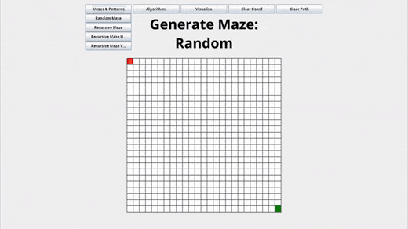
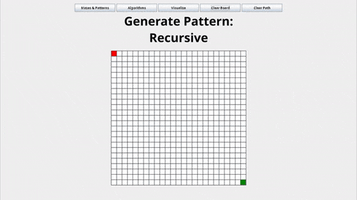
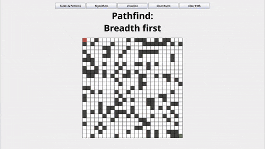
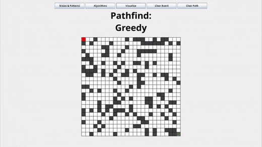
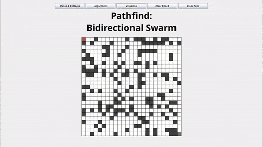

# PathFinder

A pathfinding visualization tool that finds and displays the optimal route from point A to point point B

## Features

### Mazes & Patterns

#### Random Maze

* Randomly fills empty cells with walls at a given probability, producing chaotic, non-structured layouts



#### Recursive Division

* A maze generation algorithm that recursively splits empty regions with walls, leaving gaps as passages
* Skewable Division - Biases wall placement to favor vertical or horizontal splits, creating more divisions and longer corridors in the chosen direction



### Pathfinding Algoritms

#### Breadth-First Search

* Explores all nodes at the current depth before moving deeper
* Guarantees shortest path



#### Depth-First Search

* Explores as far as possible along one path before backtracking
* Not guaranteed to find shortest path, but memory efficient


#### Greedy Search

* Always expands the node closest to the goal using a heuristic
* Fast but not guaranteed to find shortest path



#### Bidirectional Swarm Search

* Simultaneously explores from both start and goal until the two frontiers meet, then combines paths.
* Uses BFS and significantly reduces node exploration compared to standard BFS.



## Technologies Used

* Java
* Swing

## Running Locally

### Requirements

Java 25 or higher

### Using Gradle

```bash
./gradlew run
```
